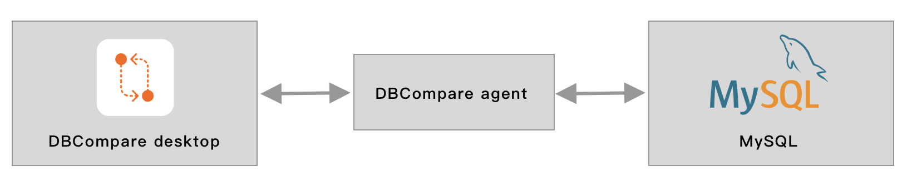

# About
This is an agent for DBCompare desktop app. 
这是DBCompare的代理节点，在某些桌面app不能直接访问数据库的时候做数据中转。桌面端访问agent接口，agent连接mysql，获取表的字段、索引等信息。再由桌面端汇总进行比较输出结果。
桌面端也可直连MySQL。




# DBCompare
DBCompare is a tool for comparing databases. more details here: https://github.com/lifang-biz/dbcompare-desktop
DBCompare是一款数据库比较工具，目前支持比较MySQL数据库的表信息、列、索引。 这里有详细介绍 ：https://github.com/lifang-biz/dbcompare-desktop

# Installation
1. Install go: https://golang.org/doc/install
2. Get Code: git clone https://github.com/lifang-biz/dbcompare-agent
3. Edit config file: conf/app.ini
4. go run 
5. Also, You can config agent as a system service. CentOS for example:

add xxx.sh beside main file

vi xxx.sh
````
#!/bin/sh

cd /path of main file
./main
````
vi /usr/lib/systemd/system/dbcompare.service

````
[Unit]
Description=DBCompare Service
After=syslog.target network.target
[Service]
Type=simple
ExecStart=path of xxx.sh
ExecStop=/bin/kill -15 $MAINPID
Restart=on-failure
User=root
Group=root
[Install]
WantedBy=multi-user.target

````

